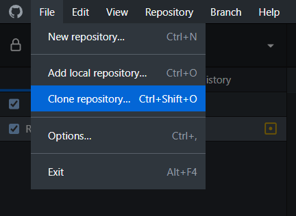
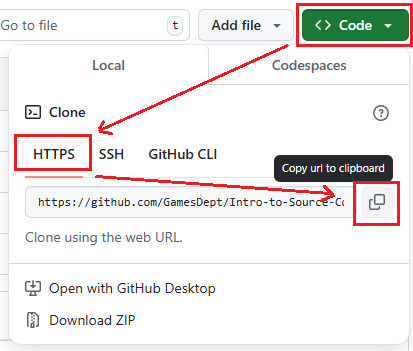
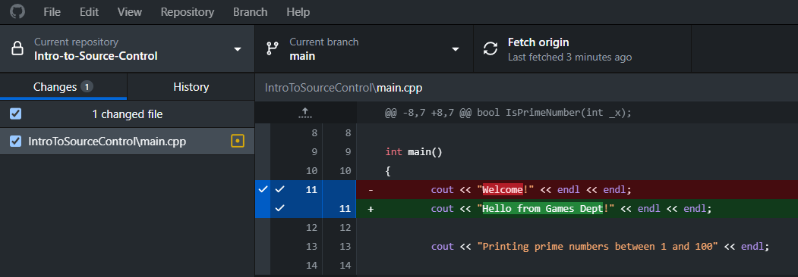
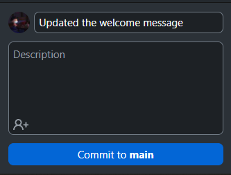
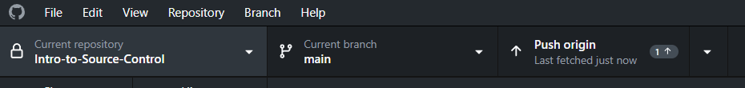

# Introduction to Source Control
An introduction to the basic uses of source control from Media Design School's Games Department. 

## What is Source Control?
Source control, also known as <i>version control</i> is the practice of controlling, organising and tacking different versions of the history of computer files.

It is useful for teams of developers as it allows multiple people to have access to the same project and keep up to date with the latest version of the project.

Additionally it is helpful for solo developers as it is a way of keeping track of changes and reverting to old versions in case of bugs, file loss and corruption. 

Source control often makes use of cloud storage but can also be hosted locally.

### What is GitHub and Git?
Github is the website you are reading this on! Github is a cloud based platform where you can store your projects in a <i>Git repository</i>. 

Git is a version control system that automatically tracks and manages your changes when you commit them to a repository. 

If you want to read more, check out this link: [about github and git](https://docs.github.com/en/get-started/start-your-journey/about-github-and-git).

## The Basics of Git's Source Control
When working with source control there are a few actions which you'll regularly use. 

These are:
- Pull
    - this is how you download or 'pull' any new files from the repository.
- Commit
    - this is <i>choosing</i> what you want to upload or 'push' to the repository. 
- Push
    - this is the action of uploading to the repository.

Some extra terms:
- Branches
    - A branch is where your commits are stored, you'll always start with a main branch. In the future you'll learn about using multiple branches.
- Merging
    - This is the action of combining two branches or two commits which override the same files. 

### Git IDEs
A Git IDE is where you'll perfom most of these actions. A Git IDE is software which will allow to interface between online repositories and files hosted locally on your computer.

Git actions can be performed using command line, however an IDE will provide a visual interface with simple actions and representaions of your commits and branches. 

# Your Exercise
This repository is storing a C++ project which finds prime numbers. 

The code written in `main.cpp` is unfinished, it is your job to complete it. 

### Step 1: Setup 
1. If you do not have a GitHub account, [create one here](https://github.com/signup). 
2. Download or open a git IDE, for this tutorial we recommend using [GitHub Desktop](https://desktop.github.com/download/). 

### Step 2: Cloning the Repository
1. In GitHub Desktop, after you have signed in, click the `Clone repository` button.
   - 
2. You'll see a few options to choose from: 
   - For `GitHub.com` you should see a list of repositories you can clone.
   - For `URL` you can paste the URL or the repository this can be found in the following image. 
   - 
3. When cloning the repository make sure to set and keep track of the `Local path`. This is where the repository will be stored on your computer. 

### Step 3: Making a Commit and Pushing.
1. Open the project on your computer using Visual Studio.
2. Modify the code some way, these could be changing the print messages or adding comments. 
3. Save the file `main.cpp` (building/running will save the file automatically). 
4. Open GitHub Desktop, here you should be able to see the changes you made to the code. 
   - This is where it will list each file that has been modified, added or deleted. 
   - You can also see individual changes within the files.
   - 
5. Name your commit, enter some text to descibe what changes you made. 
   - A well named commit will help you keep track of the history of your project.
   - 
6. Press `Commit to main`
7. At the top of your screen press `Push origin`
   - 
   - This can also be done in the Repository menu

### Step 4: Pulling
Now that you've pushed your changes you should be abe to see them reflected on the repository hosted on GitHub.com. [Click here to jump to main.cpp](IntroToSourceControl/main.cpp).

1. Make an edit to main.cpp on your browser. 
   - Look for the pencil icon
2. Save the file and commit it to main.
3. Open GitHub Desktop and press `Fetch origin`
   - <i>Fetching</i> is often a precursor to <i>pulling</i>. It checks the remote version of the repository to see if there are any new updates. 
4. After fetching, press `Pull origin`, 
   - This will update files on your local machine. 
5. Open Visual Studio to see the new changes that have been made.

Congratualtions you have successfully pulled and pushed to a repository using source control! 

### Next Steps
1. Complete the function `IsPrimeNumber(int _x)` to correctly calculate prime numbers and commit and push it to your repository.
2. Try checking out older commits, this can be done in the History tab of GitHub Desktop. 
   - <i>Checking Out</i> is the act of changing your current version of the repository on you local machine. 
   - It is used to see older versions and change between branches. 
   - Don't forget to checkout the latest commit after this!
3. Make a new repository on GitHub and clone it onto your computer. 
   - When making a new repository you'll be asked to pick a gitignore. 
     - This is a file which prevents certain files and folders from being included in the repository.
     - GitHub provides gitignore templates for different coding langauges and project types, otherwise you can create your own.  

### Questions?
Contact your lecturer about any additional questions you have.